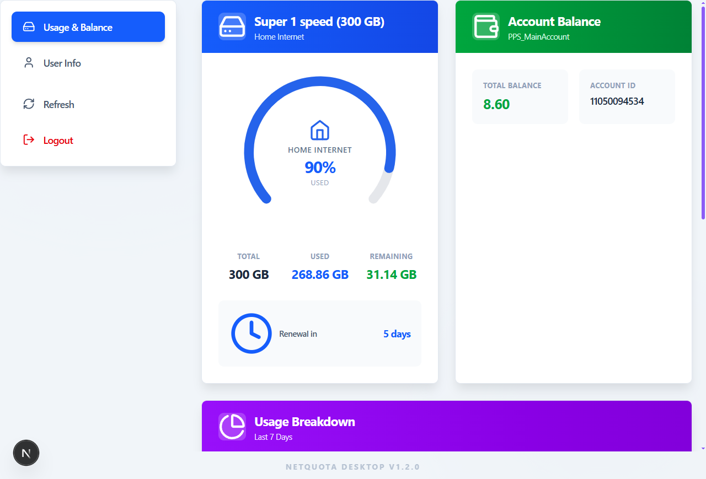
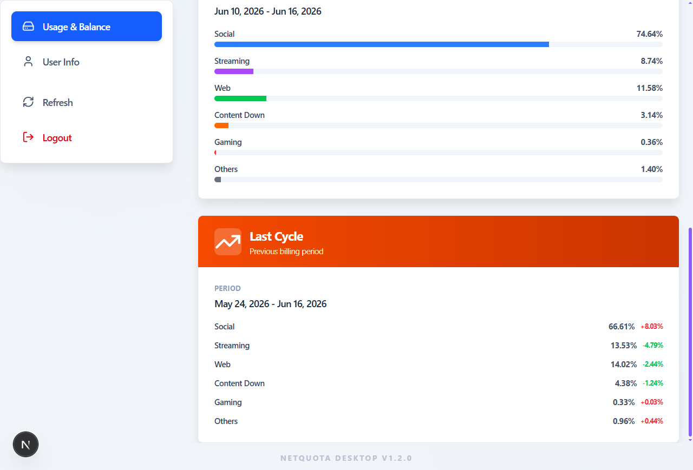
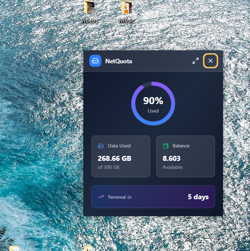

# WeQuota

A modern desktop application built with Electron, React, and TypeScript that allows users to monitor their data usage, balance, and account information in real-time. WeQuota provides a beautiful, intuitive interface for tracking network consumption with features like a mini desktop widget, system tray integration, and auto-launch capabilities.

## ScreenShots







## Features

### 🎨 Modern User Interface

- **Beautiful Dashboard**: Clean, responsive design with animated transitions
- **Usage Tracking**: Real-time data usage monitoring with visual gauges and charts
- **Balance Information**: Track account balance and available credits
- **User Profile**: View detailed account information and subscriber details
- **Dark Theme**: Modern dark-themed UI with gradient backgrounds

### 🖥️ Desktop Integration

- **Mini Widget**: Compact desktop widget showing key usage metrics
- **System Tray**: System tray icon with context menu for quick access
- **Auto-Launch**: Option to start application automatically on system boot
- **Window Management**: Toggle between main window and mini widget
- **Draggable Widget**: Mini window can be positioned anywhere on desktop

### 🔐 Secure Authentication

- **Login System**: Secure login with phone number and password
- **Captcha Support**: Built-in captcha handling for enhanced security
- **Credential Storage**: Secure local storage for auto-login
- **Session Management**: Automatic session handling and logout

### 📊 Data Visualization

- **Usage Gauges**: Circular progress indicators for data consumption
- **Usage Breakdown**: Detailed breakdown of data usage by category
- **Balance Charts**: Visual representation of account balance
- **Renewal Tracking**: Days until quota renewal countdown
- **Historical Data**: Compare usage across different time periods

### ⚡ Performance & Reliability

- **Error Handling**: Graceful error states with retry functionality
- **Loading States**: Smooth loading animations and progress indicators
- **Offline Detection**: No internet connection detection and user feedback
- **Auto-Refresh**: Automatic data refresh with manual refresh option
- **Responsive Design**: Works seamlessly on desktop and tablet devices

## Architecture

### Technology Stack

- **Frontend**: React 19, TypeScript, Tailwind CSS, Motion (Framer Motion)
- **Desktop**: Electron 39, electron-vite, electron-builder
- **Backend**: Express.js, Node.js
- **State Management**: TanStack Query (React Query)
- **Icons**: Lucide React
- **Charts**: D3.js

### Project Structure

```
WeQuota/
├── app/                    # Electron application
│   ├── main/              # Main process (Electron)
│   │   ├── helpers/       # IPC handlers and utilities
│   │   ├── windows/       # Window management
│   │   │   ├── main/      # Main application window
│   │   │   ├── mini/      # Mini widget window
│   │   │   └── captcha/   # Captcha window
│   │   └── utils/         # Main process utilities
│   ├── preload/           # Preload scripts
│   └── renderer/          # Renderer process (React)
│       ├── main/          # Main application UI
│       ├── mini/          # Mini widget UI
│       ├── Captcha/       # Captcha UI
│       └── frame/         # Frame window
├── server/                # Express API server
│   └── src/
│       ├── routes/        # API routes
│       └── index.ts       # Server entry point
├── src/                   # Next.js frontend (web version)
│   ├── components/        # React components
│   ├── pages/             # Next.js pages
│   └── types/             # TypeScript types
├── shared/                # Shared types and interfaces
├── utils/                 # Shared utilities
└── build/                 # Build assets
```

## Installation

### Prerequisites

- Node.js 18+
- npm or yarn
- Windows 10/11 (for desktop application)

### Install Dependencies

```bash
npm install
```

## Development

### Desktop Application Development

```bash
# Start Electron desktop app in development mode
npm run dev:desk

# Preview built desktop application
npm run start:desk
```

### Web Application Development

```bash
# Start Next.js web server
npm run dev

# Build for production
npm run build
```

### API Server Development

```bash
# Start Express API server
npm run dev
```

## Building

### Build Desktop Application

```bash
# Build and create installer
npm run pack
```

### Build Web Application

```bash
# Build Next.js application
npm run build
```

## Usage

### First Time Setup

1. Launch the application
2. Enter your phone number and password
3. Complete captcha verification if required
4. View your usage data on the dashboard

### Using the Mini Widget

- Double-click the system tray icon to show/hide the mini widget
- Right-click the tray icon for context menu options
- Drag the mini widget to position it on your desktop
- Click the maximize button to open the main window

### Auto-Launch Configuration

- Enable auto-launch from the Login page or User Info settings
- The application will start automatically when you log into Windows
- The mini widget will be shown on auto-start (main window hidden)

## API Endpoints

### Authentication

- `POST /api/login/captcha` - Get captcha for login
- `POST /api/login` - Login with credentials

### Data

- `POST /api/data/quota` - Get quota data
- `POST /api/data/balance` - Get balance data
- `POST /api/data/billing-usage` - Get billing usage data
- `POST /api/data/info` - Get user info
- `POST /api/data/subscriber` - Get subscriber data

### Health

- `GET /health` - Server health check

## Configuration

### Environment Variables

Create a `.env` file in the root directory:

```env
# Server Configuration
PORT=3000
NODE_ENV=development

# API Configuration
API_BASE_URL=https://api.example.com
```

## Troubleshooting

### Common Issues

**Application won't start**

- Check if Node.js is installed correctly
- Verify all dependencies are installed
- Check the logs in the application directory

**Data not loading**

- Verify your internet connection
- Check if credentials are correct
- Try refreshing the data manually
- Check the API server status

**Mini widget not showing**

- Check if auto-launch is enabled
- Verify the tray icon is visible in the system tray
- Try double-clicking the tray icon

**Captcha not working**

- Ensure you have a stable internet connection
- Try refreshing the captcha
- Check if the API is responding correctly

## Contributing

Contributions are welcome! Please feel free to submit a Pull Request.

## License

ISC

## Author

ImamAshour

## Acknowledgments

- Built with [Electron](https://www.electronjs.org/)
- UI powered by [React](https://reactjs.org/)
- Styling with [Tailwind CSS](https://tailwindcss.com/)
- Icons from [Lucide](https://lucide.dev/)
- Animations by [Motion](https://motion.dev/)
